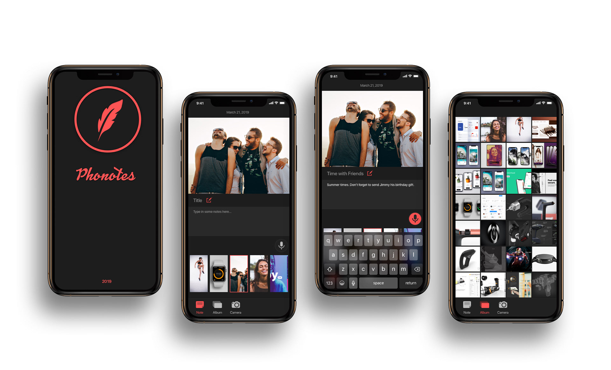

# Phonotes
An iOS app that helps users take private notes of their photos. 
By [Leah Xia](http://leahxia.com) ([leahxia5@gmail.com](mailto:leahxia5@gmail.com))

## Installation
1. Open `Phonotes.xcworkspace`
2. Press `cmd` + `R` to run the project
3. Enjoy!

## Milestones
• [ X ] 1.1.0 Load photos from local album and write note for each photo(Notes will be saved locally via Realm) 
• [   ] 1.2.0 Take photos within the app and take notes right after; View album and notes in a list. 
• [   ] 1.3.0 Add tag to photos and create a folder for each tag. 
• [   ] 1.4.0 Create account and save note in Clould. 
• [   ] 1.5.0 Share photos with notes(Bluetooth, within Phonotes app or to Instagram etc). 

## Language
• Swift 5

## Library and SDKs
• RealmSwift

## Case Study
[Part 1: UI challenges](https://medium.com/@leahxia5/ios-app-case-study-phonotes-part-1-ui-39051a6f0c71?source=messageShare-f87818f6589b-1560492467&_branch_match_id=667963676943393739)
